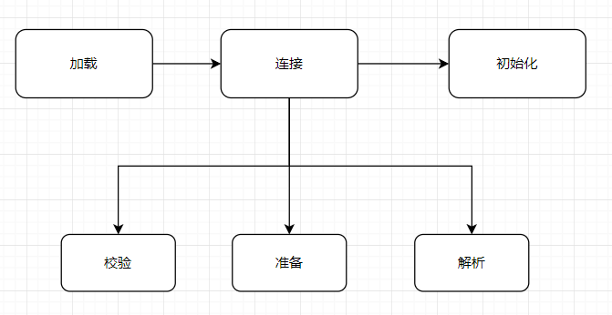

# Class装载系统

## 来取都有序：看懂Class文件的装载流程

class文件只要被class装载系统装载到jvm内部，对应的Class类型才能被jvm识别。class装载分为三个阶段：加载、连接、初始化。连接又可分为：校验、准备、解析



## 类装载的条件

类只有在初始使用时才会被初始化。类的使用方式分为两种：主动使用、被动使用。只有主动使用才会触发类的初始化。

#### 主动使用

- 通过new、反射、克隆和反序列化一个类对象时
- 调用类的静态属性时（Final修饰除外）
- 调用类的静态方法时
- 使用java.lang.reflect包中的方法反射类的方法时
- 初始化子类时，需要先初始化父类
- 包含main方法的启动类

#### demo展示

场景一：

前置说明：

- 静态代码块和静态常量会在类对象创建时初始化，所以可以通过静态代码块中的调用情况说明类对象是否初始化

```
public class Parent {
    static {
        System.out.println("Parent init");
    }

}
```

```
public class Child  extends Parent{
    static {
        System.out.println("Child init");
    }
}
```

```
public class InitMain {

    public static void main(String[] args) {
        Child c=new Child();
        Child d=new Child();
    }

}
```

结果：

```
Parent init
Child init
```

说明：

- 类对象只有在首次使用时才会被创建，虽然调用了两次new，但只有第一次调用new时才会触发类的初始化
- new对象时会触发类对象的初始化
- 创建子类对象时会触发父类对象的创建

场景二：调用父类的静态字段不会触发子类的初始化

jvm参数：-XX:+TraceClassLoading

```
public class Parent {
    static {
        System.out.println("Parent init");
    }

    public static int v=100;
}

```

```
public class Child  extends Parent{
    static {
        System.out.println("Child init");
    }
}
```

```
public class InitMain {


    public static void main(String[] args) {
        System.out.println(Child.v);
    }


}
```

结果：

```
[Loaded com.ctbiyi.jvm.ch10.Parent from file:/D:/code/jvm-in-action/target/classes/]
[Loaded com.ctbiyi.jvm.ch10.Child from file:/D:/code/jvm-in-action/target/classes/]
Parent init
100
```

结论：

- 通过子类调用父类的静态属性不会触发子类的初始化。但是子类仍旧会加载，从类的加载日志可以证明

场景三：常量不会触发类对象初始化

```
public class FinalFieldClass {

    public static final String constString = "CONST";
    static{
        System.out.println("FinalFieldClass init");
    }

}
```

```
public class UseFinalField {


    public static void main(String[] args) {
        System.out.println(FinalFieldClass.constString);
    }
}
```

结果：

```
[Loaded java.lang.Class$MethodArray from C:\Program Files\Java\jdk1.8.0_241\jre\lib\rt.jar]
[Loaded java.net.SocksSocketImpl$3 from C:\Program Files\Java\jdk1.8.0_241\jre\lib\rt.jar]
[Loaded java.lang.Void from C:\Program Files\Java\jdk1.8.0_241\jre\lib\rt.jar]
[Loaded java.net.ProxySelector from C:\Program Files\Java\jdk1.8.0_241\jre\lib\rt.jar]
[Loaded sun.net.spi.DefaultProxySelector from C:\Program Files\Java\jdk1.8.0_241\jre\lib\rt.jar]
CONST
```

类对象没有被加载和初始化

从字节码中可以看到常量在编译时已经被写入，没有任何调用FinalFieldClass的信息


ldc从常量池中加载常量到操作数栈中

### 加载类

装载类的第一个阶段为加载类。类的加载分为两个过程：

- 根据类全名获得类的二进制字节流

  可以通过类全名从文件系统、jar/war包、网络、甚至数据库中获得类的二进制字节流

- 通过二进制字节流创建类对应的java.lang.Class对象

  在java.lang.Class中保存类的数据信息

demo展示

```
public class ReflectionMain {
	public static void main(String[] args) throws Exception {
		Class clzStr=Class.forName("java.lang.String");
		Method[] ms=clzStr.getDeclaredMethods();
		for(Method m:ms){
			String mod=Modifier.toString(m.getModifiers());
			System.out.print(mod+" "+ m.getName()+" (");
			Class<?>[] ps=m.getParameterTypes();
			if(ps.length==0)System.out.print(')');
			for(int i=0;i<ps.length;i++){
				char end=i==ps.length-1?')':',';
				System.out.print(ps[i].getSimpleName()+end);
			}
			System.out.println();
		}
	}
}

```

结果：

```
public equals (Object)
public toString ()
public hashCode ()
public compareTo (String)
public volatile compareTo (Object)
public indexOf (String,int)
public indexOf (String)
public indexOf (int,int)
public indexOf (int)
static indexOf (char[],int,int,char[],int,int,int)
static indexOf (char[],int,int,String,int)
public static valueOf (int)
public static valueOf (long)
public static valueOf (float)
...
```

可以从类的Class对象中获得类的所有方法

### 验证类

连接阶段的第一个阶段为验证阶段。主要的校验步骤为：格式检查、语义检查、字节码验证、符号引用验证。


字节码校验阶段会使用到StackMapTable。在符号引用中没有找到引用的类或者方法时会抛出NoClassDefFoundError、NoSuchMethodError。

#### demo展示

场景一：加载类是没有找到对应的class文件，抛出NoClassDefFoundError

```
public class Parent {

    static{
        System.out.println("Parent init");
    }

    public static int v=100;

}
```


```
public class Child extends Parent {

    static{
        System.out.println("child init");
    }
}

```

```
public class InitMain {


    public static void main(String[] args) {
       Child c=new Child();

    }


}
```

- 同一文件夹下包含Parent、Child、InitMain

  

- 编译

  

- 删掉Child.class

  

- 运行程序

  ```
  java InitMain
  ```

结果：

```
[root@k8s-node-biyi-test-04 validate]# java InitMain
Exception in thread "main" java.lang.NoClassDefFoundError: Child
        at InitMain.main(InitMain.java:5)
Caused by: java.lang.ClassNotFoundException: Child
        at java.net.URLClassLoader$1.run(URLClassLoader.java:360)
        at java.net.URLClassLoader$1.run(URLClassLoader.java:349)
        at java.security.AccessController.doPrivileged(Native Method)
        at java.net.URLClassLoader.findClass(URLClassLoader.java:348)
        at java.lang.ClassLoader.loadClass(ClassLoader.java:430)
        at sun.misc.Launcher$AppClassLoader.loadClass(Launcher.java:326)
        at java.lang.ClassLoader.loadClass(ClassLoader.java:363)
        ... 1 more
```

场景二：找不到类对应的方法抛出NoSuchMethodError

```
public class Child  {

    public void hello(){
        System.out.println("hello child");
    }

}
```

```
public class InitMain {

    public static void main(String[] args) {
       Child c=new Child();
        c.hello();
    }

}
```

- 编译

  ```
  javac *.java
  ```

- 运行

  ```
   java InitMain
  ```

结果：

```
hello child
```

修改Child类：

```
public class Child  {
}
```

去掉hello()方法

- 编译Child类

  ```
  javac Child.java 
  ```

- 运行

  ```
   java InitMain
  ```

结果：

```
Exception in thread "main" java.lang.NoSuchMethodError: Child.hello()V
        at InitMain.main(InitMain.java:6)
```

### 准备

准备阶段为Class对象分配空间，并初始化变量为默认值，常量值为常量

#### java类型的默认值

| 类型      | 默认值   |
| --------- | -------- |
| int       | 0        |
| long      | 0L       |
| short     | (short)0 |
| char      | \u0000   |
| boolean   | false    |
| reference | null     |
| float     | 0f       |
| double    | 0f       |

#### demo展示

```
public class FinalFieldClass {

    public static final String constString = "CONST";
    
}
```


constString为常量

去掉final，修改变量为变量


编译器生成了<clinit>方法，在该方法中对类属性constString赋值。

### 解析类

解析过程会将符号引用转换为直接引用

符号引用：字节码指令中涉及的类、方法、属性均为符号引用

#### demo展示

```
public class FinalFieldClass {

    public static String constString = "CONST";


}
```


符号引用在编译时就确定，可以通过符号引用明确java代码的语义。但是方法调用时需要直接引用。通过直接引用可以定位到对象在内存上的地址，方法和属性在对象上的的偏移量。

#### 字符串常量的优化

字符串常量对应常量池中的CONSTANT_String类型。类型为CONSTANT_String会被添加到运行时常量池，相同内容的字符串只会保存一份。通过String.intern()方法会查找常量池是否有相同内容的字符串常量，如果有则返回该引用，没有的话将该字符串添加到常量池中后返回常量池中该字符串的引用

#### demo展示

```
public class StringIntern {

	public static void main(String[] args) {
		String a=Integer.toString(1)+Integer.toString(2)+Integer.toString(3);
		String b="123";
		String c="123";
		System.out.println(a.equals(b));
		System.out.println(a==b);
		System.out.println(c==b);
		System.out.println(a.intern()==b);
	}

}
```

结果：

```
true
false
true
true
```

结论：

- c==b返回true，表示相同内容的字符串在常量池中只会保存一份
- a.intern()==b返回true，表示如果常量池中已经存在相同内容的值intern()会返回该引用

场景二：

```
public class StringIntern {

	public static void main(String[] args) {
		String a=Integer.toString(1)+Integer.toString(2)+Integer.toString(3);
		String e=a.intern();
		String b="123";
		System.out.println(a==b);
	}

}
```

结果：

```
true
```

结论：

- 解析CONSTAN_String时如果常量池中已经有相同内容的字符串会将该引用为字符串的直接引用

场景三：CONSTRANT_String

当给变量赋值为字符串常量值时，该字符串常量为CONSTRANT_String

```
	public static void main(String[] args) {
		String b="123";
	}
```


当通过赋值final修饰的变量时

```
	private static final String f="123";;
	public static void main(String[] args) {
		String c=f;
	}
```


可见，两种写法在字节码层面是相同的

### 初始化

初始化会调用编译器自动生成的<clinit>方法为类对象的属性赋值。<clinit>方法的内容为静态变量和静态代码块中的内容。如果没有静态代码块或者静态变量则不会生成该方法。

#### demo展示

场景一：

```
public class StaticFinalClass {
	public static final int i=1;
	public static final int j=2;
}
```

结果：


结论：没有静态变量和静态代码块不会生成<clinit>方法

场景二：

```
public class SimpleStatic {
	public static int id=1;
	public static int number;
	static{
		number=4;
	}
}
```


父子类对象的初始化顺序为先初始化父类对象，再初始化子类对象，则子类中的属性值会覆盖父类中的属性值

#### demo展示

```
public class SimpleStatic {
	public static int id=1;
	public static int number;
	static{
		number=4;
	}
}
```

```

public class ChildStatic extends SimpleStatic{
	static{
		number=2;
	}
	public static void main(String[] args) {
		System.out.println(number);
	}
}

```

结果：

```
2

```


存在的问题：jvm会通过锁确保类对象只会初始化一次，这意味着类的初始化可能会造成死锁

#### demo展示

```
public class StaticA {
	static{
		try {
			Thread.sleep(1000);			
		} catch (InterruptedException e) {
		}
		try {
			Class.forName("com.ctbiyi.jvm.ch10.staticdead.StaticB");
		} catch (ClassNotFoundException e) {
			e.printStackTrace();
		}
		System.out.println("StaticA init OK");
	}
}

```

```
public class StaticB {
	static{
		try {
			Thread.sleep(1000);
		} catch (InterruptedException e) {
		}
		try {
			Class.forName("com.ctbiyi.jvm.ch10.staticdead.StaticA");
		} catch (ClassNotFoundException e) {
		}
		System.out.println("StaticB init OK");
	}
}
```

```
public class StaticDeadLockMain extends Thread{
	private char flag;
	public StaticDeadLockMain(char flag){
		this.flag=flag;
		this.setName("Thread"+flag);
	}
	@Override
	public void run(){
		try {
			Class.forName("com.ctbiyi.jvm.ch10.staticdead.Static"+flag);
		} catch (ClassNotFoundException e) {
			e.printStackTrace();
		}
		System.out.println(getName()+" over");
	}
	public static void main(String[] args) throws InterruptedException {
		StaticDeadLockMain loadA=new StaticDeadLockMain('A');
		loadA.start();
		StaticDeadLockMain loadB=new StaticDeadLockMain('B');
		loadB.start();
	}
}
```


结果：程序陷入死锁状态

而且类加载过程中的死锁visual vm中是检测不出来的


## 一切Class从这里开始：掌握ClassLoader

类加载的过程由ClassLoader完成，获得二进制字节码流交给连接处理。

### 认识ClassLoader，看懂类加载

classloader的主要接口：

- public Class<?> loadClass(String name) throws ClassNotFoundException

  根据类签名获得类对象。

- protected final Class<?> defineClass(byte[] b,int off,int len)

  从字节数组中加载类对象

- protected Class<?> findClass(String name) throws ClassNotFoundException

  根据指定类签名获得二进制字节流，利用defineClass获得类对象。

- protected final Class<?> findLoadedClass(String name)

  查找已经被加载的类

loadClass为public，提供对外服务。在其内部先通过findLoadedClass查看该类是否已经加载，没有加载的话根据定义好的双亲委派模型加载。双亲没有加载到该类会将实际的加载工作交给findClass，由findclass完成类对象加载

### ClassLoader的分类

classloader主要分为三类，不同的类负载不同的加载模块。

- 启动类加载器：cpp语言编写的类加载器，负责核心类库的加载，如rt.jar。对应的java类型为null
- 扩展类加载器：其双亲为启动类加载器，负载ext包下的类加载。对应的java类为ExtClassLoader
- 应用类加载器：其双亲为扩展类加载器，负载应用程序的加载。对应的java类为AppClassLoader


#### demo展示

```
public class PrintClassLoaderTree {
	public static void main(String[] args) {
		ClassLoader cl=PrintClassLoaderTree.class.getClassLoader();
        while(cl!=null){
            System.out.println(cl);
            cl=cl.getParent();
        }
        System.out.println("String classloader:"+String.class.getClassLoader());
	}
}
```

结果：

```
sun.misc.Launcher$AppClassLoader@18b4aac2
sun.misc.Launcher$ExtClassLoader@7f31245a
String classloader:null
```

结论：

- String是核心类由启动类加载器加载

### ClassLoader的双亲委托模式

当类加载器需要加载类时，首先查看该类是否已经被自己加载过，如果已经加载过了则返回该类对象，否则委托给父类加载，如果父类加载成功则返回，否则由该类加载器加载类对象。


源码：

```
    protected Class<?> loadClass(String name, boolean resolve)
    {
            Class<?> c = findLoadedClass(name);
            if (c == null) {
                    if (parent != null) {
                        c = parent.loadClass(name, false);
                    } else {
                        c = findBootstrapClassOrNull(name);
                    }
                }                 

                if (c == null) {                
                    c = findClass(name);
                }
            }
            return c;
    }

```

#### demo演示

场景一：输出不同类加载器的加载路径

```
public class ClassLoaderPath {
	public static void main(String args[]){


		URL[] urls = sun.misc.Launcher.getBootstrapClassPath().getURLs();
		for (URL url : urls) {
			System.out.println(url);
		}

		System.out.println("------------------------");

		URL[] urlsext = ((URLClassLoader) ClassLoader.getSystemClassLoader().getParent()).getURLs();
		for (URL url : urlsext) {
			System.out.println(url);
		}

		System.out.println("------------------------");

		URL[] urlApp = ((URLClassLoader) ClassLoader.getSystemClassLoader()).getURLs();
		for (URL url : urlApp) {
			System.out.println(url);
		}

	}
}
```

结果输出：

```
file:/C:/Program%20Files/Java/jdk1.8.0_241/jre/lib/resources.jar
file:/C:/Program%20Files/Java/jdk1.8.0_241/jre/lib/rt.jar
file:/C:/Program%20Files/Java/jdk1.8.0_241/jre/lib/sunrsasign.jar
file:/C:/Program%20Files/Java/jdk1.8.0_241/jre/lib/jsse.jar
file:/C:/Program%20Files/Java/jdk1.8.0_241/jre/lib/jce.jar
file:/C:/Program%20Files/Java/jdk1.8.0_241/jre/lib/charsets.jar
file:/C:/Program%20Files/Java/jdk1.8.0_241/jre/lib/jfr.jar
file:/C:/Program%20Files/Java/jdk1.8.0_241/jre/classes
------------------------
file:/C:/Program%20Files/Java/jdk1.8.0_241/jre/lib/ext/aa/
file:/C:/Program%20Files/Java/jdk1.8.0_241/jre/lib/ext/access-bridge-64.jar
file:/C:/Program%20Files/Java/jdk1.8.0_241/jre/lib/ext/cldrdata.jar
file:/C:/Program%20Files/Java/jdk1.8.0_241/jre/lib/ext/dnsns.jar
file:/C:/Program%20Files/Java/jdk1.8.0_241/jre/lib/ext/jaccess.jar
file:/C:/Program%20Files/Java/jdk1.8.0_241/jre/lib/ext/jfxrt.jar
file:/C:/Program%20Files/Java/jdk1.8.0_241/jre/lib/ext/localedata.jar
file:/C:/Program%20Files/Java/jdk1.8.0_241/jre/lib/ext/nashorn.jar
file:/C:/Program%20Files/Java/jdk1.8.0_241/jre/lib/ext/sunec.jar
file:/C:/Program%20Files/Java/jdk1.8.0_241/jre/lib/ext/sunjce_provider.jar
file:/C:/Program%20Files/Java/jdk1.8.0_241/jre/lib/ext/sunmscapi.jar
file:/C:/Program%20Files/Java/jdk1.8.0_241/jre/lib/ext/sunpkcs11.jar
file:/C:/Program%20Files/Java/jdk1.8.0_241/jre/lib/ext/zipfs.jar
------------------------
file:/C:/Program%20Files/Java/jdk1.8.0_241/jre/lib/charsets.jar
file:/C:/Program%20Files/Java/jdk1.8.0_241/jre/lib/deploy.jar
file:/C:/Program%20Files/Java/jdk1.8.0_241/jre/lib/ext/access-bridge-64.jar
file:/C:/Program%20Files/Java/jdk1.8.0_241/jre/lib/ext/cldrdata.jar
file:/C:/Program%20Files/Java/jdk1.8.0_241/jre/lib/ext/dnsns.jar
file:/C:/Program%20Files/Java/jdk1.8.0_241/jre/lib/ext/jaccess.jar
file:/C:/Program%20Files/Java/jdk1.8.0_241/jre/lib/ext/jfxrt.jar
file:/C:/Program%20Files/Java/jdk1.8.0_241/jre/lib/ext/localedata.jar
file:/C:/Program%20Files/Java/jdk1.8.0_241/jre/lib/ext/nashorn.jar
file:/C:/Program%20Files/Java/jdk1.8.0_241/jre/lib/ext/sunec.jar
file:/C:/Program%20Files/Java/jdk1.8.0_241/jre/lib/ext/sunjce_provider.jar
file:/C:/Program%20Files/Java/jdk1.8.0_241/jre/lib/ext/sunmscapi.jar
file:/C:/Program%20Files/Java/jdk1.8.0_241/jre/lib/ext/sunpkcs11.jar
file:/C:/Program%20Files/Java/jdk1.8.0_241/jre/lib/ext/zipfs.jar
file:/C:/Program%20Files/Java/jdk1.8.0_241/jre/lib/javaws.jar
file:/C:/Program%20Files/Java/jdk1.8.0_241/jre/lib/jce.jar
file:/C:/Program%20Files/Java/jdk1.8.0_241/jre/lib/jfr.jar
file:/C:/Program%20Files/Java/jdk1.8.0_241/jre/lib/jfxswt.jar
file:/C:/Program%20Files/Java/jdk1.8.0_241/jre/lib/jsse.jar
file:/C:/Program%20Files/Java/jdk1.8.0_241/jre/lib/management-agent.jar
file:/C:/Program%20Files/Java/jdk1.8.0_241/jre/lib/plugin.jar
file:/C:/Program%20Files/Java/jdk1.8.0_241/jre/lib/resources.jar
file:/C:/Program%20Files/Java/jdk1.8.0_241/jre/lib/rt.jar
file:/C:/Program%20Files/Java/jdk1.8.0_241/src.zip
file:/D:/code/jvm-in-action/target/classes/
file:/D:/repo2/cglib/cglib/3.2.12/cglib-3.2.12.jar
file:/D:/repo2/org/ow2/asm/asm/7.1/asm-7.1.jar
file:/D:/repo2/asm/asm-all/2.2/asm-all-2.2.jar
file:/C:/Program%20Files/JetBrains/IntelliJ%20IDEA%202020.2.4/lib/idea_rt.jar

```

场景二：类优先让双亲加载

jvm参数：-Xbootclasspath/a:D:/tmp/clz  -XX:+TraceClassLoading

- -Xbootclasspath/a 给启动类加载器的加载路径添加新的目录

```
package com.ctbiyi.jvm.ch10.findorder;

public class HelloLoader {
	public void print(){
		System.out.println("I am in apploader");
//	    System.out.println("I am in Boot ClassLoader");
	}
}

```

```
package com.ctbiyi.jvm.ch10.findorder;

public class FindClassOrder {
	public static void main(String args[]){
		HelloLoader loader=new HelloLoader();
		loader.print();
		Class<? extends HelloLoader> cl = loader.getClass();
		System.out.println(cl.getClassLoader());
	}
}
```

操作步骤：

1. 创建新的路径:D/tmp/clz

2. 修改HelloLoader类为：

   ```
   package com.ctbiyi.jvm.ch10.findorder;
   
   public class HelloLoader {
   	public void print(){
   	    System.out.println("I am in Boot ClassLoader");
   	}
   }
   
   ```

   编译HelloLoader.class，然后将其放到D/tmp/clz目录下。

   

3. 修改HelloLoader类为：

   ```
   package com.ctbiyi.jvm.ch10.findorder;
   
   public class HelloLoader {
   	public void print(){
   		System.out.println("I am in apploader");
   	}
   }
   ```

4. 添加jvm启动参数：-Xbootclasspath/a:D:/tmp/clz  -XX:+TraceClassLoading。运行FindClassOrder

5. 结果：

   ```
   ...
   [Loaded com.ctbiyi.jvm.ch10.findorder.HelloLoader from D:/tmp/clz]
   I am in Boot ClassLoader
   null
   ...
   ```

   启动类加载器和应用类加载器的加载路径下都要HelloLoader类，最终的类由启动类加载器加载

场景三：类加载器会首先查看该类是否已经被加载过，如果已经加载过则不会委派父类加载

jvm参数：-Xbootclasspath/a:D:/tmp/clz  -XX:+TraceClassLoading

```
public class FindClassOrder2 {
	public static void main(String args[]) throws Exception {		
		ClassLoader cl=FindClassOrder2.class.getClassLoader();
		byte[] bHelloLoader=loadClassBytes("HelloLoader.class");
		Method md_defineClass=ClassLoader.class.getDeclaredMethod("defineClass", byte[].class,int.class,int.class);
		md_defineClass.setAccessible(true);
		md_defineClass.invoke(cl, bHelloLoader,0,bHelloLoader.length);
		md_defineClass.setAccessible(false);
		
		HelloLoader loader = new HelloLoader();
		loader.print();
	}


	private static byte[] loadClassBytes(String className) throws ClassNotFoundException {
		try {
//			URL aa = FindClassOrder2.class.getResource(className);
			FileInputStream fis = new FileInputStream("D:\\code\\jvm-in-action\\target\\classes\\com\\ctbiyi\\jvm\\ch10\\findorder\\HelloLoader.class");
			FileChannel fileC = fis.getChannel();
			ByteArrayOutputStream baos = new ByteArrayOutputStream();
			WritableByteChannel outC = Channels.newChannel(baos);
			ByteBuffer buffer = ByteBuffer.allocateDirect(1024);
			while (true) {
				int i = fileC.read(buffer);
				if (i == 0 || i == -1) {
					break;
				}
				buffer.flip();
				outC.write(buffer);
				buffer.clear();
			}
			fis.close();
			return baos.toByteArray();
		} catch (IOException fnfe) {
			throw new ClassNotFoundException(className);
		}
	}
}

```

结果：

```
[Loaded com.ctbiyi.jvm.ch10.findorder.HelloLoader from __JVM_DefineClass__]
I am in apploader
```

结论：

- 委派的前提是该类没有被加载过
- ClassLoader中的委派逻辑写在classloader，defineClass中没有委派逻辑，所以会直接加载类

场景四：双亲加载器不会询问子类加载器

```
public class FindClassOrder3 {
	public static void main(String args[]) throws Exception {		
		ClassLoader cl=FindClassOrder3.class.getClassLoader();
		byte[] bHelloLoader=loadClassBytes("D:\\code\\jvm-in-action\\target\\classes\\com\\ctbiyi\\jvm\\ch10\\findorder\\HelloLoader.class");
		Method md_defineClass=ClassLoader.class.getDeclaredMethod("defineClass", byte[].class,int.class,int.class);
		md_defineClass.setAccessible(true);
		md_defineClass.invoke(cl, bHelloLoader,0,bHelloLoader.length);
		md_defineClass.setAccessible(false);


		Object loader =  cl.getParent().loadClass("com.ctbiyi.jvm.ch10.findorder.HelloLoader").newInstance();
		System.out.println(loader.getClass().getClassLoader());
		Method m=loader.getClass().getMethod("print", null);
		m.invoke(loader, null);
	}


	private static byte[] loadClassBytes(String className) throws ClassNotFoundException {
		try {
			FileInputStream fis = new FileInputStream(className);
			FileChannel fileC = fis.getChannel();
			ByteArrayOutputStream baos = new ByteArrayOutputStream();
			WritableByteChannel outC = Channels.newChannel(baos);
			ByteBuffer buffer = ByteBuffer.allocateDirect(1024);
			while (true) {
				int i = fileC.read(buffer);
				if (i == 0 || i == -1) {
					break;
				}
				buffer.flip();
				outC.write(buffer);
				buffer.clear();
			}
			fis.close();
			return baos.toByteArray();
		} catch (IOException fnfe) {
			throw new ClassNotFoundException(className);
		}
	}
}

```

结果：

```
[Loaded com.ctbiyi.jvm.ch10.findorder.HelloLoader from __JVM_DefineClass__]
[Loaded com.ctbiyi.jvm.ch10.findorder.HelloLoader from D:/tmp/clz]
null
I am in Boot ClassLoader
```

结论：

- 系统类加载器已经加载过HelloLoader类对象了，扩展类加载器仍旧会委派启动类加载器加载HelloLoader
- 在jvm中由类加载器和类对象本身唯一，相同的类可以由不同的类加载分别加载

场景五：扩展类加载器和应用类加载器的路径下都有HelloLoader，由扩展类加载器加载HelloLoader类

jvm参数：  -XX:+TraceClassLoading    -Djava.ext.dirs=D:/tmp/clz

```
public class HelloLoader {
	public void print(){
		System.out.println("I am in apploader");
//	    System.out.println("I am in Boot ClassLoader");
	}
}
```

```
public class ExtClassloader {

    public static void main(String args[]){
        HelloLoader loader=new HelloLoader();
        loader.print();
        Class<? extends HelloLoader> cl = loader.getClass();
        System.out.println(cl.getClassLoader());
    }
    
}    
```

输出Boot ClassLoader的HelloLoader存放到D:/tmp/clz路径下。

##### 请注意


aa可以为任意的名称，之所以有这层目录是直接将com放大D:/tmp/clz下扩展类加载器不识别。


结果：

```
[Loaded com.ctbiyi.jvm.ch10.findorder.HelloLoader from file:/D:/tmp/clz/aa/]
I am in Boot ClassLoader
sun.misc.Launcher$ExtClassLoader@60e53b93
```


### 双亲委托模式的弊端

双亲委托可以让子加载器访问父类加载器加载的类，但是父类加载器不能访问子类加载器加载的类。而在一些特殊场景需要让父类加载器访问子类加载器加载的类。比如JDBC，在核心类库下定义了接口和接口的工厂类。具体的实现类由应用加载器加载，导致了核心类库中的工厂无法创建应用加载器加载的实现类。


### 双亲委托模式的补充

使用spi机制可以让启动类加载委派类加载请求给应用类加载器完成实现类的载入。


上下文类加载器作为第三方，启动类加载器获得到上下文类加载器，即就是系统类加载器。从而可以加载第三方提供的实现类

```
class Thread{    
    public void setContextClassLoader(ClassLoader cl) {
        contextClassLoader = cl;
    }
    
    public ClassLoader getContextClassLoader() {
        return contextClassLoader;
    }
}    
```

### 突破双亲模式

有些场景下需要覆盖classloader，让子类加载器优先加载类，此时可以突破双亲模式

#### demo展示

OrderClassLoader类加载器优先加载，加载不到委派给父类加载

```
public class OrderClassLoader extends ClassLoader {
	private String fileName;

	public OrderClassLoader(String fileName) {
		this.fileName = fileName;
	}

	protected Class<?> loadClass(String name, boolean resolve) throws ClassNotFoundException {
		// First, check if the class has already been loaded
		Class re = findClass(name);
		if (re == null) {
			System.out.println("I can't load the class:" + name + " need help from parent");
			return super.loadClass(name, resolve);
		}
		return re;
	}

	protected Class<?> findClass(String className) throws ClassNotFoundException {
		Class clazz = this.findLoadedClass(className);
		if (null == clazz) {
			try {
				String classFile = getClassFile(className);
				FileInputStream fis = new FileInputStream(classFile);
				FileChannel fileC = fis.getChannel();
				ByteArrayOutputStream baos = new ByteArrayOutputStream();
				WritableByteChannel outC = Channels.newChannel(baos);
				ByteBuffer buffer = ByteBuffer.allocateDirect(1024);
				while (true) {
					int i = fileC.read(buffer);
					if (i == 0 || i == -1) {
						break;
					}
					buffer.flip();
					outC.write(buffer);
					buffer.clear();
				}
				fis.close();
				byte[] bytes = baos.toByteArray();
				clazz = defineClass(className, bytes, 0, bytes.length);
			} catch (FileNotFoundException e) {
				e.printStackTrace();
			} catch (IOException e) {
				e.printStackTrace();
			}
		}
		return clazz;
	}

	private byte[] loadClassBytes(String className) throws ClassNotFoundException {
		try {
			String classFile = getClassFile(className);
			FileInputStream fis = new FileInputStream(classFile);
			FileChannel fileC = fis.getChannel();
			ByteArrayOutputStream baos = new ByteArrayOutputStream();
			WritableByteChannel outC = Channels.newChannel(baos);
			ByteBuffer buffer = ByteBuffer.allocateDirect(1024);
			while (true) {
				int i = fileC.read(buffer);
				if (i == 0 || i == -1) {
					break;
				}
				buffer.flip();
				outC.write(buffer);
				buffer.clear();
			}
			fis.close();
			return baos.toByteArray();
		} catch (IOException fnfe) {
			throw new ClassNotFoundException(className);
		}
	}

	private String getClassFile(String name) {
		StringBuffer sb = new StringBuffer(fileName);
		name = name.replace('.', File.separatorChar) + ".class";
		sb.append(File.separator + name);
		return sb.toString();
	}
}

```

```
public class DemoA {

}
```

```
public class ClassLoaderTest {
    public static void main(String[] args) throws ClassNotFoundException {
        OrderClassLoader myLoader=new OrderClassLoader("D:/tmp/clz/");
        Class clz=myLoader.loadClass("com.ctbiyi.jvm.ch10.brkparent.DemoA");
        System.out.println(clz.getClassLoader());
        
        System.out.println("==== Class Loader Tree ====");
        ClassLoader cl=clz.getClassLoader();
        while(cl!=null){
            System.out.println(cl);
            cl=cl.getParent();
        }
    }
}

```

结果：

```
java.io.FileNotFoundException: D:\tmp\clz\java\lang\Object.class (系统找不到指定的路径。)
	at java.io.FileInputStream.open0(Native Method)
	at java.io.FileInputStream.open(FileInputStream.java:195)
	at java.io.FileInputStream.<init>(FileInputStream.java:138)
	at java.io.FileInputStream.<init>(FileInputStream.java:93)
	at com.ctbiyi.jvm.ch10.brkparent.OrderClassLoader.findClass(OrderClassLoader.java:37)
	at com.ctbiyi.jvm.ch10.brkparent.OrderClassLoader.loadClass(OrderClassLoader.java:24)
	at java.lang.ClassLoader.loadClass(ClassLoader.java:351)
	at java.lang.ClassLoader.defineClass1(Native Method)
	at java.lang.ClassLoader.defineClass(ClassLoader.java:756)
	at java.lang.ClassLoader.defineClass(ClassLoader.java:635)
	at com.ctbiyi.jvm.ch10.brkparent.OrderClassLoader.findClass(OrderClassLoader.java:53)
	at com.ctbiyi.jvm.ch10.brkparent.OrderClassLoader.loadClass(OrderClassLoader.java:24)
	at java.lang.ClassLoader.loadClass(ClassLoader.java:351)
	at com.ctbiyi.jvm.ch10.brkparent.ClassLoaderTest.main(ClassLoaderTest.java:11)
I can't load the class:java.lang.Object need help from parent
com.ctbiyi.jvm.ch10.brkparent.OrderClassLoader@6d6f6e28
==== Class Loader Tree ====
com.ctbiyi.jvm.ch10.brkparent.OrderClassLoader@6d6f6e28
sun.misc.Launcher$AppClassLoader@18b4aac2
sun.misc.Launcher$ExtClassLoader@330bedb4
```

Object类OrderClassLoader加载不到委派给父类加载器加载


在tomcat中突破了双亲委派模式

# 字节码执行

## 代码如何执行：字节码执行案例

字节码指令占1个byte。使用javap可以查看字节码文件中的指令详情

#### demo展示

```
public class Calc {
	public int calc() {
		int a = 500;
		int b = 200;
		int c = 50;
        System.out.println(100000.0d);
		return (a + b) / c;
	}
}    
```

使用javap -v Calc，查看字节码：

```
public int calc();
    flags: ACC_PUBLIC
    Code:
      stack=3, locals=4, args_size=1
         0: sipush        500
         3: istore_1      
         4: sipush        200
         7: istore_2      
         8: bipush        50
        10: istore_3      
        11: getstatic     #2                  // Field java/lang/System.out:Ljava/io/PrintStream;
        14: ldc2_w        #3                  // double 100000.0d
        17: invokevirtual #5                  // Method java/io/PrintStream.println:(D)V
        20: iload_1       
        21: iload_2       
        22: iadd          
        23: iload_3       
        24: idiv          
        25: ireturn       
```

  左边的0:、3：、4：为code[code_length]中的索引号。

- 初始状态

  

  对应实例方法，局部变量表的0操作默认保存this对象

- sipush：将short类型的变量入栈

  

  ```
  sipush        500
  ```

  表示将500保存至操作数栈

  

- istore_1：将int类型保存至局部变量表槽位1处

  


- sipush        200

  将200保存至操作数栈

  

- istore_2 将int保存至局部变量表槽位2处

  

- bipush        50：将50写入操作数栈

  

  

- istore_3：将操作数栈顶的int保存至局部变量表槽位3处

  

- iload_1：将局部变量表槽位1处保存至操作数栈

  

- iload_2：加载局部变量表槽位2到操作数栈

  

- iadd：加法指令。从操作数栈中出栈两个数，结果保存至操作数栈


- iload_3：将局部变量表索引3处保存至操作数栈

  

  

- idiv：整数除法


- ireturn：销毁当前栈帧，返回int值到调用栈的操作数栈


## 执行的基础：Java虚拟机常用指令介绍

### 常量入栈指令

#### const系列

入栈的常量包含在指令中

- acount_null：将null压入操作数栈
- iconst_m1:将-1压入操作数栈
- lconst_0、lconst_1：将0L、1L压入操作数栈
- fconst_0、fconst_1和fconst_2：将0F、1F和2F压入操作数栈
- dconst_0、dconst_1：将双精度浮点数0/1压入操作数栈

#### push系列

- bipush：将byte变量压入操作数栈
- sipush：将short变量压入操作数栈

#### ldc系列

- ldc index：index为byte，将常量池中的索引处的常量压入操作数栈

  

- ldc_w byte：宽索引。index为2个byte，索引的范围更广，将常量池中的索引处的常量压入操作数栈

  

- ldc2 index：index为byte，将常量池中的索引处的long、double常量压入操作数栈

  

- ldc2_w index：宽索引。index为2个byte，索引的范围更广，将常量池中的索引处的long、double常量压入操作数栈

  

```
        System.out.println(100000.0d);
```


#### 局部变量压栈指令

将局部变量表中的数据压入操作数栈。

主要分为三类指令：

- xload index：局部变量不能超过4个。x为i、l、f、d、a
- xload_n：表示将第n个局部变量压入操作数栈。n为0-3，x为i、l、f、d、a
- xaload：表示将数组元素压栈，要求执行该指令时栈顶元素为数组索引，栈顶第二个元素为数组引用。该指令会弹出栈顶的两个元素然后将数组元素a[i]压入栈顶。x为i、l、f、d、a、b、c、s

x表示的数据类型：

| x取值 | 含义       |
| ----- | ---------- |
| i     | int类型    |
| l     | long类型   |
| f     | float类型  |
| d     | double类型 |
| a     | 数组类型   |
| b     | byte类型   |
| c     | char类型   |
| s     | short类型  |

#### demo展示

```
public void print3(char[] cs,short[] s){
    System.out.println(s[0]);
    System.out.println(cs[0]);
}
```


aload_2将局部变量表索引2即short的引用保存至操作数栈，iconst_0将整形常量0保存至操作数栈，saload将栈顶的两个变量出栈，将s[0]处的值保存至操作数栈。

aload_1将局部变量表索引1即char数组的引用保存至操作数栈，iconst_0将整形常量0保存至操作数栈，caload加栈顶的两个数据出栈，将cs[0]处的值保存至操作数栈

### 出栈装入局部变量表指令

将操作数栈中的数据保存至局部变量表的相应位置处。

主要由3类指令：

- xstore index：index为byte类型。将操作数栈中的数据保存至index处。x为i、l、f、d、a

  

- xstore_n：n为0到3，x为i、l、f、d、a、n

  

- xastore：将操作数栈中的数据存入数组。执行xastore时，栈顶需要由三个元素：值、数组中的索引、数组引用，弹出栈顶的三个元素将结果保存至局部变量表中的指定位置处

  

#### demo展示

```
public void print4(char[] cs,short[] s){
    int i,j,k,x;
    x=99;
    s[0]=77;
}
```


- bipush 99：将99推送在操作数栈
- istore 6：将栈顶的数据弹出然后保存至局部变量表中的索引6处。
- aload_2：将局部变量表索引为2处的数据保存至操作数栈
- iconst_0:将常量0保存至操作数栈
- bipush 77：将77保存至操作数栈
- sastore：将栈顶的77、0和s引用弹出，然后将77赋值给s[0]

#### 通用型操作

通用型操作没有具体的数据类型。

- NOP：什么也不做

  

- dup：复制栈顶的值压入栈帧

  

- dup2：复制栈顶的1或2个值

  

- pop：弹出栈顶的值

  

- pop2：将栈顶的1或2个值弹出

  

#### demo展示

```
public void print5(int i){
    Object obj=new Object();
    obj.toString();
}

```


- new   ：创建一个对象并压入栈中

  

- 将object对象复制然后存入栈中

- invokespecial #1                  // Method java/lang/Object."<init>":()V

  调用栈顶的object对象的初始化方法

- astore_2将栈顶的object引用保存至局部变量表索引2处

- aload_2 将局部变量表索引2处的object存入栈顶

- invokevirtual #9                  // Method java/lang/Object.toString:()Ljava/lang/String;

- pop将栈顶的元素弹出

#### 类型转换指令

形式为x2y，x为i、f、l、d，y为i、f、l、d、c、s、b。

i2l表示将int数据转成long类型，将栈顶的int出栈，将其转换为long后重新压入栈中


#### demo展示

```
public void print6(int i){
    long l=i;
    float f=l;
    int j=(int)l;
}
```


问题：指令有i2b、i2c、i2s，但是没有b2i、c2i、s2i？

```
public void print7(byte i){
    int k=i;
    long l=k; 
}
```


将byte类型转为int只是通过栈的出入完成的，将int转为long需要通过i2l指令完成

原因：

- 将byte当做int来处理可以减少字节码的指令
- 局部变量表和操作数栈的槽位都是32位的，byte在局部变量表中也是当做int处理的，所以不需要转换

### 运算指令

- 加法指令：iadd、ladd、fadd、dadd
- 减法指令：isub、lsub、fsub、dsub
- 乘法指令：imul、lmul、fmul、dmul
- 除法指令：idiv、ldiv、fdiv、ddiv
- 取余指令：irem、lrem、frem、drem
- 数值取反：ineg、lneg、fneg、dneg
- 自增指令：iinc
- 位运算指令
  - 位移指令：ishl、ishr、iushr、lshl、lshr、lushr
  - 按位或指令：ior、lor
  - 按位与指令：iand、land
  - 按位异或指令：ixor、lxor


#### demo展示

```
public void print8(){
    float i=8;
    float j=-i;
    i=-j;
}
```


指令fneg将操作数栈顶的数取反

```
public void print8_1(){
    int i=123;
    i=i+10;
    i++;
}
```


iinc对局部变量做自增操作


```
public void print8_2(){
    int i=123;
    int j=~i;
}
```


### 对象/数组操作指令

#### 创建指令

new创建普通对象、newarray创建基本类型数组、anewarray创建对象类型数组、multianewarray创建多维数组

```
public void print8_3(){
    Object obj=new Object();
    int[] intarray=new int[10];
    Object[] objarray=new Object[10];
    int[][] mintarray=new int[10][10];
}
```


创建长度为10的，类型为Object的数组对象，并将该数组对象引用入栈


创建int类型的二维数组，一维长度为10，二维长度为10，维度为2，并将数组引用入栈

#### 字段访问指令

getfield、putfield操作实例对象的字段，getstatic、putstatic创建类的静态字段。


栈顶为对象的应用，indexbyte1<<8|indexbyte2为常量池中的索引，表示调用对象到的对应属性，将结果保存到栈顶。


indexbyte1<<8|indexbyte2为常量池中的索引，表示将对应类型的静态常量保存到操作数栈

#### demo展示

```
public void print8_4(){
    System.out.println("hello");
}
```


将类System.out的静态属性PrintStream压入操作数栈

#### 类型检查指令

- checkcast：检查对象是否是给定的类型

  

  栈顶为需要检查对象的引用，indexbyte1<<8|indexbyte2为常量池中的索引号，表示对象需要匹配的类型

- instanceof：判断对象是否指定的类型

  

  栈顶为待检查对象的引用，indexbyte1<<1|indexbyte2为常量池中的索引号，为待检查对象需要匹配的类型

#### demo展示

```
public String print8_5(String obj){
    if(obj instanceof String){
        return (String)obj;
    }else{
        return null;
    }
}
```


#### 数组操作指令

arraylength：取数组长度


### 比较控制指令

#### 比较指令

比较栈顶的两个数的大小，将结果入栈

- dcmpg：比较double类型的大小，当为NAN时将1压入栈顶

  

- dcmpl：比较double类型的大小，当为NAN时将-1压入栈顶

  

- fcmpg

  

- lcmp

  

#### 条件跳转指令

- ifeq
- iflt
- ifle
- ifne
- ifgt
- ifge
- ifnull
- ifnonnull


将栈顶的值出栈，如果条件满足跳转到branchbyte1<<1|branchbyte2位置处

##### demo展示

```
public void print8_6(){
    float f1=9;
    float f2=10;
    System.out.println(f1>f2);
}
```


fcmpl将结果入栈，ifle比较栈顶的元素是否满足<=0

#### 比较条件跳转指令

将比较和跳转合二为一。

- if_icmpeq

  

- if_icmpne

- if_icmplt

- if_icmpgt

- if_icmple

- if_icmpge

- if_acmpeq

  

- if_acmpne

##### demo展示

场景一：比较数字

```
public void print8_7(){
    short f1=9;
    byte f2=10;
    System.out.println(f1>f2);
}
```


偏移量9和10将变量入栈，if_cmple比较前者<=后者是否成立，如果成立跳转到偏移量18处将0入栈，否则继续执行偏移量14处将1入栈

场景二：比较对象

```

public void print8_8(){
    Object f1=new Object();
    Object f2=new Object();
    System.out.println(f1==f2);
    System.out.println(f1!=f2);
}
```


19和20行将对象引用f1、f2入栈，然后使用if_acmpne比较两者的大小是否成立，如果成立跳转到28处

35和36行将对象引用f1、f2入栈，然后使用if_acmpeq比较两者的大小是否成立，如果成立跳转到28处

#### 多条件分支跳转

实现方式有两种：tableswitch，lookupswitch传。

- tableswitch ：case的数值连续，保存有最大值和最小值和offset，通过计算获得到指定的offset上执行，不再范围内执行default
- lookupswitch：case可以不连续，需要比较每个case-offset，没有对应的case执行default

##### demo展示

场景一：case连续：

```

public void print8_9(int i){
    switch(i){
        case 1:break;
        case 2: break;
        case 3: break;
    }
}
```


场景二：case不连续

```
public void print8_10(int i){
    switch(i){
        case 100:break;
        case 200: break;
        case 300: break;
    }
}
```


当case的类型为String时，在case中保存字符串对应的hashcode，为了防止hashcode冲突，需要执行equals进行进一步的比较，

场景三：case类型为字符串类型

```
public void print8_11(String i){
    int j=0;
    switch(i){
        case "geym":j=1;break;
        case "zbae": j=2;break;
        case "java": j=3;break;
        default:
    }
}
```


假设i=“geym"，其执行过程为：

- iconst_0：将常数0入栈
- istore_2：将0保持至局部变量表槽位2处
- aload_1：将局部变量表1槽位处的索引入栈。i的引用在栈顶
- astore_3：将栈顶的数据保存至局部变量表槽位3处。
- iconst_m1：将常量-1入栈
- istore        4：将-1保存至局部变量表槽位4处
- aload_3：加载局部变量表槽位3到栈顶。i的操作在栈顶
- invokevirtual #18                 // Method java/lang/String.hashCode:()I ：调用i的hashCode()，将结果入栈
- lookupswitch：依次比较栈顶的值。由于栈顶为"geym" ，所以`3169394: 44`成立，跳转到44处执行
-  aload_3 ：将局部变量表槽位3入栈：i在栈顶
-  ldc           #19                 // String geym：将常量"geym"入栈
- invokevirtual #20                 // Method java/lang/String.equals:(Ljava/lang/Object;)Z  ：调用i的equals()，参数为"geym"，进行比较。结果为true
- ifeq          86：如果为0则跳转到86 。整数0表示false。不进行跳转，继续执行
- iconst_0 ：将常量0入栈
-  istore        4：栈顶元素保存至局部变量表槽位4处。
- goto          86：跳转到86偏移量处
-  iload         4：加载局部变量表槽位4处的值。
- tableswitch：利用tableswitch进行判断。此时j=0，case 0成立。跳转到116处
- iconst_1：常量1入栈
- istore_2：栈顶保存至局部变量表槽位2处
- goto          131：跳转到131处
- return    ：返回

可见字符串的比较也是利用loopupswitch和equals和临时中间变量，最后由tableswitch完成实际case条件中语句的执行。

#### 无条件跳转

- goto：跳转到指定位置处执行

  

- goto_w：跳转到指定位置处执行。（位置的范围更大）

  

### 函数调用与返回指令

- invokevirtual：根据实例进行派发。栈顶为对象引用及其参数。方法调用的时候，一个新的栈帧从java栈中被创建出来，对象引用及其参数被保存到新栈帧的局部变量表中。如果函数有返回结果的话在方法执行结果将返回结果保存到被调用者操作数的栈顶

  

- invokeinterface：调用接口方法。count为接口方法的调用参数的个数

  

- invokespecial：调用构造函数、私有方法、父类方法。静态分派。

  

- invokestatic：调用静态方法。静态分派。

  

- invokedynamic：调用动态方法。jdk7新增指令

  

  返回指令为xreturn。x为不同的类型。返回指令为return时，表示返回为空。

##### demo展示

场景一：invokevirtual的使用

```
public void print8_12(){
    System.out.println("hello");
}
```


-  getstatic     #2                  // Field java/lang/System.out:Ljava/io/PrintStream; ：将静态常量对象System.out的引用入栈
- ldc           #12                 // String hello ：常量字符串hello入栈
- invokevirtual #13                 // Method java/io/PrintStream.println:(Ljava/lang/String;)V  ：调用System.out的println静态方法，入参为hello。栈顶的两个元素出栈
- return  ：返回为空值

场景二：invokeinterface、invokespecial的使用

```
public void print8_13(){
    Thread t=new Thread();
    t.run();
    ((Runnable)t).run();
}
```


-  new           #23                 // class java/lang/Thread ：在堆上新建一个thread对象，并将其引入入栈
- dup：复制栈顶的元素
- invokespecial #24                 // Method java/lang/Thread."<init>":()V  ：调用thread对象的<init>初始化方法，<init>方法中返回实例化后的thread到栈顶
- astore_1：将栈顶的对象保存至局部变量表槽位1处
- aload_1：将局部变量表槽位1处的值入栈
- invokevirtual #25                 // Method java/lang/Thread.run:()V  ：调用thread对象的run()方法
- aload_1：将栈顶的thread对象保存至局部变量表槽位1处
- invokeinterface #26,  1           // InterfaceMethod java/lang/Runnable.run:()V ：调用接口Runnable的run()方法，1表示方法的参数为0（this对象）
- return：返回空值

场景三：调用类的私有方法和父类方法

```
private void pMethod(){

}

public void invokeSpecial2(){
    pMethod();
    super.toString();
}
```


- aload_0：将局部变量表中槽位0的数据入栈。栈顶为this
- invokespecial #27                 // Method pMethod:()V  ：调用this的私有方法pMethod()
- aload_0：同上
- invokespecial #9                  // Method java/lang/Object.toString:()Ljava/lang/String;  ：调用父类的toString()方法

### 同步控制指令

- monitorenter：进入一个对象的monitor。当minitor的计时器为0时表示该线程获得该对象的锁，将计数器加1，每次进入monitor时都会将计数器加1.其它线程碰到monitor的计数器不为0时会进入等待状态直到计数器的值为0

  

- monitorexit：退出一个monitor。每次执行时将monitor对应的计数器减一，等计数器的值为0时退出该monitor，然后其它的线程就可以抢夺该monitor

  

#### demo展示

```
public class SyncAdd{

private int i=0;

public synchronized void add1(){
    i++;
}

public void add2(){
    synchronized(this){
        i++;
    }
}

}
```

- 静态方法的字节码

  

  从字节码的层面没有任何的同步信息。同步方法是jvm通过隐式的同步完成

- 同步代码块

  

  - aload_0：将this入栈

  - dup：复制栈顶

  - astore_1：将this保存至局部变量表槽位1

  - monitorenter：尝试获取this对象的monitor，获取到继续执行，否则进入等待

  - ...：对变量值加一的指令

  - monitorexit：释放minitor，等待线程可以尝试获取minitor

  - goto          24：跳转到24处执行。程序正常结束

  - astore_2：此时发送了异常，栈顶为异常对象。将异常对象保存至局部变量表槽位2处

  - aload_1：将this入栈

  - monitorexit：释放this的monitor

  - aload_2：将异常对象入栈

  - athrow：抛出异常对象。会首先坚查该异常对象是否是异常处理表中的异常及其子类，如果是则跳转到对应位置继续执行，否则继续抛给调用栈的栈帧中执行同样的处理，如果没有任何栈帧可以处理该线程结束执行

    

    编译器会自动为同步块添加异常处理器，捕获同步块中的异常执行monitorexit指令确保即使出现异常的情况下monitor也可以正常退出

    

## 跑的再快点：静态编译优化

静态编译分为两种：javac命令编译（前端编译器）和jit即时编译器编译（后端编译器）。目前优化的重点是后端编译器，前端编译器仅限于java语言，而后端编译器可以让所以运行在jvm平台上的语言都收益，当然也包括java。

### 编译时计算

常量表示式会在编译期就计算其结果。常见的常量表达式为算术表达式和字符串表达式

#### demo展示

场景1：计算表达式的编译时计算

```
	public void cirlcle(){
		for(int i=0;i<60*60*24*1000;i++){
			
		}
	}
```


编译时已经计算出`60*60*24*1000`的结果了

场景二：字符串表达式的编译时计算

```
	public static void createString(){
		String info1="select * from test";
		String info2="select * "+"from test";
		String info3="select * ".concat("from test");
		System.out.println(info1==info2);
		System.out.println(info1==info3);
		System.out.println(info2==info3);
		System.out.println(info2==info3.intern());
	}
```

结果：

```
true
false
false
true
```


info2的结果在编译时就可以确定，所以就在编译时计算。info3需要调用对象的方法，计算推迟到程序运行时。

### 变量字符串的连接

当字符串通过+号连接时，编译器会将其优化为使用StringBuilder进行拼接。

#### demo展示

```
    public static void addString(String str1,String str2){
        String str3=str1+str2;
    }
```


StringBuilder为线程不安全的，用于字符串变量为线程私有变量的拼接

### 基于常量的条件语句裁剪

使用到字符串常量的会在编译时就被替换为常量

#### demo展示

```
public class FinalFlag {
    public static final boolean flag=true;
}
```

```
	public void checkflag(){
		if(FinalFlag.flag){
			System.out.println("flag is true");
		}else{
			System.out.println("flag is false");
		}
	}
```


编译时已经将字符串常量替换为true。这个也说明字符串常量的引用不会引起类的初始化。

### switch语句的优化

tableswitch需要case的值连续，lookupswitch的值可以不连续，但是tableswitch的效率高于lookupswitch。编译器可能会对case不连续的值填充为连续的值然后使用tableswitch

#### demo展示

```
	public void swtich(int i){
	    switch(i){
	        case 1:break;
	        case 2:break;
	        case 5:break;
	        default:
	            System.out.println("");
	    }
	}
```


编译器会填充3,4的值让其跳转到default语句

## 提高虚拟机的执行效率：JIT及其相关参数

jvm的解释执行有两种：软件模拟字节码的执行和模板解释器。其效率不是很高，需要JIT在程序运行时将函数编译为机器码，程序执行jit生产的机器码来提高jvm的执行效率

### 开启JIT编译

jvm的编译有三种模式：

- 使用解释器模式：全部代码均用解释器执行，不进行JIT编译

  

- 使用编译器模式：全部代码使用jit编译器进行编译后执行

  

- 使用混合模式：热点代码使用编译模式，非热点代码使用解释模式。执行次数多的语句会被编译器认为是热点代码

  

#### demo展示

```

public class C1C2TimeMain {
	public static double calcPi(){
		double re=0;
		for(int i=1;i<10000;i++){
			re+=((i&1)==0?-1:1)*1.0/(2*i-1);
		}
		return re*4;
	}
	public static void main(String[] args) throws InterruptedException {
		Thread.sleep(20000);
		long b=System.currentTimeMillis();
		for(int i=0;i<10000;i++)
			calcPi();		
		long e=System.currentTimeMillis();
		System.out.println("spend:"+(e-b)+"ms");
		
	}
}

```

场景一：使用解释器模式

```
[root@k8s-node-biyi-test-04 jit]# java -Xint C1C2TimeMain
spend:3211ms
```

场景二：使用混合模式

```
[root@k8s-node-biyi-test-04 jit]# java   C1C2TimeMain
spend:421ms
```

场景三：使用编译器模式

```
[root@k8s-node-biyi-test-04 jit]# java -Xcomp C1C2TimeMain
spend:198ms
```

结论：在该场景下使用编译器模式的运行效率远远大于混合模式和解释器模式

### JIT编译器阈值

在混合模式中热点代码和非热点代码到的区分点在于调用次数是否查过一定阈值，该阈值可以通过-设定XX:CompileThreshold。默认情况下在clien模式下该值为1500，server模式下为10000.

#### demo展示

```
public class JITSimpleTest {

    public static void met(){
        int a=0,b=0;
        b=a+b;
    }
    public static void main(String[] args) throws InterruptedException {
        for(int i=0;i<500;i++){
            met();
        }
        Thread.sleep(1000);
    }
}
```

met()方法被调用500次

场景一：使用默认值

jvm参数： -XX:+PrintCompilation 


不会有任何代码被JIT编译器编译

场景二：设置CompileThreshold=500

jvm参数：-XX:CompileThreshold=500 -XX:+PrintCompilation 


met方法已经被JIT编译了

### 多级编译器

jit编译器中有两类编译器：

- C1编译器：编译速度快，但是编译出来的代码的质量低
- C2编译器：编译速度慢，编译出代码的质量高

jvm通过使用分级编译器，不同级别的编译器分别使用c1编译器和c2编译器，平衡了编译器的速度和效率。

分级编译器分为5级：

- 0级（解释执行）：采用解释执行，不采集性能监控数据
- 1级（简单的C1编译）：使用C1编译器进行简单的编译，其速度比较快，采集性能监控数据
- 2级（有限的C1编译）：使用C1编译器在1级的基础上进行更多的编译
- 3级（完全的C1编译）：使用C1编译器对代码完全编译
- 4级（C2编译器）：使用C2编译器对代码进行编译

#### demo展示

jvm参数：-XX:+PrintCompilation -server  -Xcomp  -XX:+TieredCompilation  

```
public class WriterMain {
	public static void main(String[] args) throws InterruptedException {
		long b=System.currentTimeMillis();
		WriterService ws=new WriterService();
		for(int i=0;i<20000000;i++){
			ws.service();
		}
		long e=System.currentTimeMillis();
		System.out.println("spend:"+(e-b));
		ws=null;
		System.gc();
		Thread.sleep(5000);
	}
}
```


参数说明：

- 时间戳：表示距离程序启动的时间
- 编译id：编译器对编译代码的编号
- 属性：描述代码的属性
  - %：栈上替换
  - s：同步方法
  - ！：方法有异常处理
  - b：阻塞模式编译
  - n：本地方法的一个包装
- 编译级别：0-4
- 方法名
- 方法大小

made not entrant表示该编译代码不能被新的代码使用，但是该编译代码仍旧在使用。如果该编译代码不再使用则被标记为made zombie，之后可以被清理掉

结果：DBWriter::write()的编译代码1138的代码在时间戳1872处生成，编译级别为3.新的编译代码1139在时间戳1872处生成，编译级别为4.有了更高质量的代码1139会优先使用。1138的编译代码在1873时间处标记made not entrant，在2428时间处被标记为made zombie。

### OSR栈上替换

热点代码有两类：

- 调用次数多的方法。将方法调用次数超过指定阈值的方法编译。在方法入口会判断该方法是否有编译代码，如果有的话则使用编译后的方法，否则通过解释模式执行该方法

  

- 循环次数多的代码块。会将循环次数达到指定阈值的代码编译。在循环的入口处判断该代码块是否有编译后的代码，如果有则使用编译后的代码，否则通过解释器解释执行该代码。由于替换语句的只是循环块的内容，而不是整个的方法，需要在原来方法的栈帧上替换，又称为栈上替换OSR（On Stack Replacement）。

  

  

#### demo展示

```
	public static void main(String[] args) throws InterruptedException {
		long b=System.currentTimeMillis();
		WriterService ws=new WriterService();
		for(int i=0;i<20000000;i++){
			ws.service();
		}
		long e=System.currentTimeMillis();
		System.out.println("spend:"+(e-b));
		ws=null;
		System.gc();
		Thread.sleep(5000);
	}
```


%表示栈上替换。main方法由于内部有循环语句进行栈上替换。

JIT编译器将循环相关的指令称为回边指令，回边为字节码中向后跳转的指令，循环指令也是一种回边指令

### 设置代码缓存大小

JIT将编译的代码都存放在CodeCache处，当CodeCache满的时候JIT停止工作，jvm从编译模式退回到解释模式，性能显著下降，虽然CodeCache会被gc清理，即使经过GC后CodeCache有多余的空间了JIT也不会重新工作。涉及的参数-XX:ReservedCodeCacheSize


### 方法内联

JIT会使用方法内联减少方法的调用次数提高系统的性能，内联的方法太多的话编译后的代码占用更大的内存空间。可以通过jvm参数-XX:FreqInlineSize控制内联方法的大小，低于该值的方法才会被内联，超过该值的方法不会产生内联。

#### demo展示

```
public class InLineMain {
	static int i=0;
	public static void inc(){
		i++;
	}
	public static void main(String[] args) {
		long b=System.currentTimeMillis();
		for(int j=0;j<100000000;j++){
			inc();
		}
		long e=System.currentTimeMillis();
		System.out.println(e-b);
	}
}
```

场景一：使用内联

jvm参数：-Xcomp -server -XX:+Inline

```
9
```

循环方法会被优化成：

```
	for(int j=0;j<100000000;j++){
		i++;
	}
```

场景二：不使用内联

jvm参数：-Xcomp -server -XX:-Inline

```
261
```

结论：内联可以显著调高方法的执行效率


